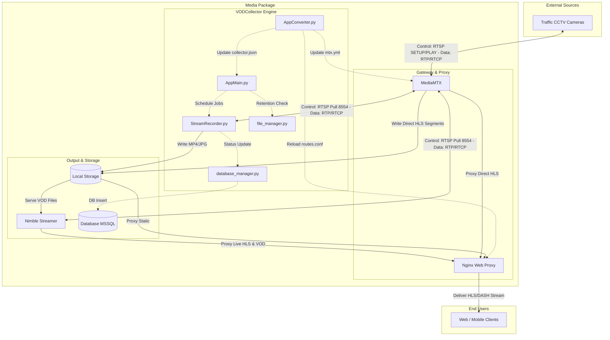
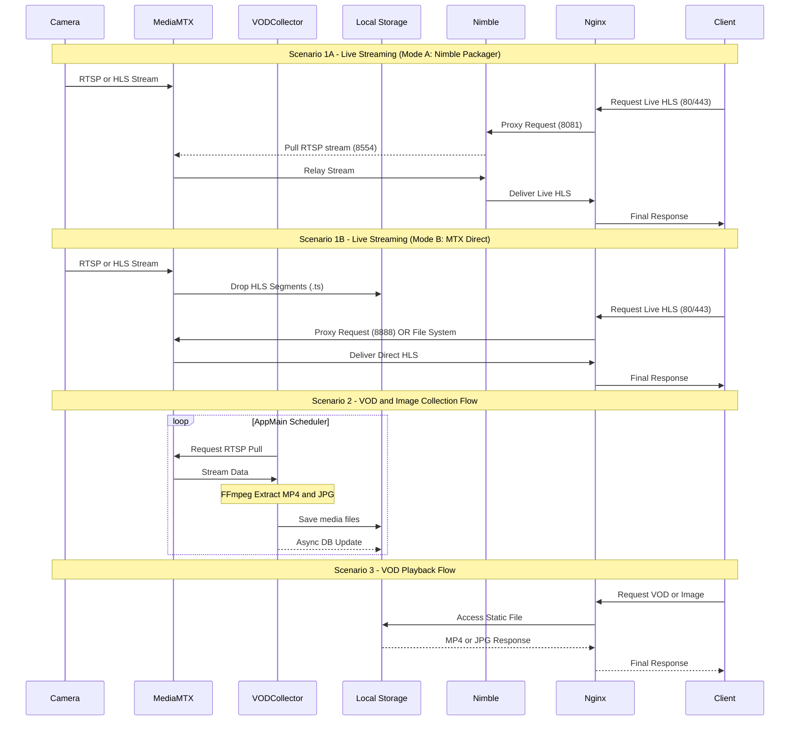

# 교통 CCTV 영상 수집 프레임워크 아키텍처 및 상세 설계서

본 문서는 MediaMTX, VODCollector 및 Nimble Streamer를 기반으로 한 교통 CCTV 영상 수집, 저장, 그리고 분배 시스템의 전체 아키텍처와 컴포넌트 세부 기능, 그리고 시스템 내 데이터 흐름을 상세하게 정의한 기술 문서입니다.

---

## 1. 전체 시스템 아키텍처 (System Architecture)

아래 다이어그램은 외부 교통 CCTV부터 최종 사용자에게 스트리밍 서비스가 제공되기까지의 컴포넌트 간 관계와 데이터/제어 흐름을 나타냅니다.



### 💡 1.1 주요 컴포넌트 I/O 및 역할 요약표

앞서 설명한 **스트림 수집 방식(Live/On-Demand Pull)**과 각 컴포넌트의 물리적인 **포트 및 파일 저장 경로**를 한눈에 파악할 수 있도록 요약한 표입니다.

| 컴포넌트 | 입력 (Input) & 수집 방식 | 출력 (Output) & 포트 | 역할 및 파일 생성 경로 |
|---|---|---|---|
| **CCTV 카메라** | - | RTSP, HLS 원본 스트림 | 외부 현장 교통 영상 제공 (주로 `554` 포트) |
| **MediaMTX** | 카메라 원본 (RTSP `554`)<br>• **수집방식**: Live Pull (상시) 또는 On-Demand Pull (요청시) | 내부 RTSP (`8554`)<br>자체 HLS (`8888`) | **역할**: 미디어 게이트웨이 및 HLS 트랜스먹싱<br>**경로**: `./media/hls/{채널명}` (.m3u8, .ts) |
| **VODCollector** | 내부 RTSP (`8554`)<br>REST API (`8000`) | DB 커넥션 (`1433`)<br>Nginx/MTX 제어 신호 | **역할**: 스케줄링, FFmpeg 녹화/캡처, 설정 자동 동기화<br>**경로**: `{app}/vod/*.mp4`, `{app}/jpg/*.jpg` |
| **Nimble Streamer**| 내부 RTSP (`8554`) (Live Pull)<br>VOD MP4 파일 (File I/O) | HTTP / HLS / DASH<br>(`8081`) | **역할**: 대용량 Live / VOD 엣지 스트리밍 송출<br>**경로**: 파일 생성 없음 (메모리 RAM 캐싱 처리) |
| **Nginx** | MediaMTX (`8888`)<br>Nimble (`8081`), API (`8000`) | HTTP / HTTPS<br>(`80` / `443`) | **역할**: 웹 리버스 프록시 및 정적 파일/스트림 라우팅<br>**경로**: 지정된 `root` 경로에서 정적 파일 서빙 |
| **Client** | 웹/모바일 HLS/DASH (`80/443`) | - | 최종 사용자 미디어 플레이어 |

---

## 2. 디렉토리 구성 및 컴포넌트 위치 (Directory Structure)

전체 시스템은 크게 `MediaMTX`와 `VODCollector` 두 개의 핵심 디렉토리로 구성되며, 각각 독립적인 역할과 실행 스크립트를 포함하고 있습니다.

```text
media-pkg/
├── MediaMTX/                       # 미디어 게이트웨이 및 프록시 (Go 기반)
│   ├── mediamtx-1.15.6/            # 커스텀 패치된 MediaMTX 소스 및 바이너리
│   ├── cfg/                        # MediaMTX 기본 초기 설정 파일
│   ├── nginx/                      # 로컬 프록시용 Nginx 설정 폴더
│   ├── mtx.0.yml                   # MediaMTX 전역 설정의 원본 베이스 템플릿 파일 (포트, 인증 등 고정 설정)
│   ├── mtx.yml                     # 실제 실행 시 참조되는 운영 설정 파일 (AppConverter가 mtx.0.yml을 기반으로 채널을 동적 주입하여 자동 갱신함)
│   └── run.sh / drun.sh            # 데몬 및 도커 컨테이너 실행 스크립트
│
└── VODCollector/                   # 스케줄링 및 자동화 수집 엔진 (Python 기반)
    ├── AppMain.py                  # API 서버(FastAPI) 및 작업 스케줄러(apscheduler) 메인 프로세스
    ├── AppConverter.py             # 설정 파일 감시(watchdog) 및 동기화 모듈
    ├── stream_recorder.py          # FFmpeg 기반 영상(MP4) 및 이미지(JPG) 수집 워커
    ├── database_manager.py         # DB(MSSQL) 비동기 연결 및 상태/메타데이터 업데이트 모듈
    ├── file_manager.py             # 스토리지 보존(Retention) 관리 및 Cleanup 모듈
    ├── file_uploader.py            # 원격 스토리지 연동 및 전송 모듈
    ├── AppConfig.py                # VODCollector 전역 설정 파일 로드 모듈
    ├── nimble/                     # Nimble Streamer 연동/설치 스크립트 및 보조 툴
    └── run.sh / drun_nimble.sh     # VODCollector 실행 및 Nimble 연동 컨테이너 실행 스크립트
```

* **`MediaMTX/`**: 외부 카메라로부터 직접 연결을 받아주는 프록시 서버입니다. Go언어 기반으로 빌드된 바이너리와 설정 파일들이 위치합니다.
  * **`mtx.0.yml`**: MediaMTX의 구동 포트, TLS 인증서, 자체 HLS 설정 등 변하지 않는 '전역 베이스 설정'을 담고 있는 마스터 템플릿 파일입니다.
  * **`mtx.yml`**: 실제 MediaMTX 프로세스가 구동될 때 읽어 들이는 설정 파일입니다. VODCollector의 `AppConverter.py`가 동적으로 변경되는 CCTV 채널 라우팅 정보(`paths:`)를 `mtx.0.yml`에 결합하여 이 파일로 계속해서 덮어씌우며 시스템을 자동 갱신합니다.
* **`VODCollector/`**: 영상 수집, 데이터베이스 기록, 설정 동기화 등의 백엔드 코어 로직이 위치하며, 폴더 내부의 파이썬 스크립트들이 각각 독립적인 컴포넌트 역할을 수행합니다.

---

## 3. 주요 컴포넌트 상세 설계 및 설명

### 3.1 MediaMTX (미디어 게이트웨이, 프록시 및 자체 HLS 오리진)
오픈 소스 MediaMTX(v1.15.6) 기반으로, 현장의 CCTV 직접 접속으로 인한 부하를 방지하기 위해 단일 커넥션 창구(Proxy) 역할을 수행합니다. 내부 시스템(Nimble, VODCollector)은 카메라가 아닌 MediaMTX를 바라보고 통신합니다.

* **자체 HLS 생성 및 송출 (HLS Drop/Origin 역할)**: MediaMTX는 RTSP 프록싱에만 그치지 않고, 내부적으로 스트림을 트랜스먹싱하여 `8888` 포트 및 로컬 디렉토리(`./media/hls`)를 통해 **자체적인 HLS 스트림을 생성하여 떨어뜨리는 역할**을 적극 수행합니다. 특히 Nimble Streamer가 생략된 경량화(VMS) 환경에서는 Nginx가 MediaMTX가 직접 떨어뜨린 HLS를 바로 읽어 시청자에게 곧바로 라이브 스트리밍을 제공합니다.
* **암호화 스트림 수집 (RTSPS 지원)**: 카메라 장비 자체가 보안 프로토콜을 요구할 경우, 설정(`mtx.yml`)의 `source`에 `rtsps://` 주소를 매핑하여 TLS 인증서 기반의 암호화된 원본 스트림을 안전하게 Ingest(가져오기)하도록 구성되어 있습니다.
* **최적화 및 호환성 패치 (MediaMTX v1.15.6 소스 및 의존성 라이브러리 개조 분석)**:
  `MediaMTX/ReadMe.txt` 파일을 분석해 보면, MediaMTX 자체 레포지토리(`internal/...`) 뿐만 아니라, MediaMTX를 구동하는 핵심 엔진 역할을 하는 **의존성(Dependency) 패키지들(`github.com/bluenviron/...`)**에 대해 광범위한 직접 수정이 이루어졌음을 확인할 수 있습니다.
  이는 대부분 규격을 완벽히 지키지 않는 구형/특수 목적 CCTV 카메라(지자체 장비)나, Nimble Streamer와 같은 써드파티 솔루션과의 연동 시 발생하는 "비표준(Non-standard) 프로토콜 예외 상황"을 서버가 관대하게 수용(Tolerate)하도록 파서(Parser)를 개조한 내역입니다.

  **[의존성 라이브러리 수정 상세 분석]**
  
  **1. `bluenviron/gortsplib` 수정 내역 (RTSP/SDP 코어 라이브러리)**
  이 패키지는 RTSP 통신과 SDP 구문 분석을 전담하는 MediaMTX의 가장 핵심적인 라이브러리입니다.
  * **RTSP `GET_PARAMETER` 응답 메시지 헤더 제거**
    * **위치**: `v5@v5.2.2/server_session.go`
    * **수정 내용**: RTSP 세션을 유지하기 위한 `GET_PARAMETER` 요청에 대해 응답할 때, 본문(Body)이 비어있음에도 포함되던 `Content-Type: text/parameters` 헤더를 강제 삭제하고 단순히 `200 OK` 상태 코드만 반환하도록 수정했습니다.
    * **목적**: Nimble Streamer가 해당 Content-Type을 받았을 때 파싱 오류를 일으키는 호환성 버그를 우회하기 위함입니다.
  * **SDP `m=meta` 허용 및 `v=` 파싱 예외 처리**
    * **위치**: `v5@v5.2.2/pkg/sdp/sdp.go`
    * **수정 내용**: SDP에서 허용되는 미디어 타입(video, audio 등) 검사 로직에 비표준인 `meta` 문자열을 추가로 허용했습니다. 또한 SDP 프로토콜 버전을 나타내는 `v=` 필드가 표준 규격 순서를 무시하고 들어와도 파싱을 시도하도록 로직을 추가했습니다.
    * **목적**: Nimble Streamer가 생성하는 다소 변형된 형태의 규격 외 SDP 문서를 에러 없이 정상적으로 수용하기 위함입니다.
  * **RTSP Session 헤더 중복 수용**
    * **위치**: `v5@v5.2.2/pkg/headers/session.go`
    * **수정 내용**: 클라이언트가 `Session` 헤더를 2번 이상 중복 전송할 경우 즉시 접속을 끊어버리던 방어 로직(`if len(v) > 1 { return fmt.Errorf... }`)을 주석 처리하여 무력화했습니다.
    * **목적**: 규격을 어기고 헤더를 중복 발송하는 일부 레거시 장비의 연결을 끊지 않고 유지하기 위함입니다.
  * **Transport 헤더 내 `interleaved` 파라미터 중복 무시 (포항시 CCTV 대응)**
    * **위치**: `v5@v5.0.0/pkg/headers/keyval.go`
    * **수정 내용**: RTSP 전송 방식을 협상할 때 `interleaved=0-1;interleaved=0-3`처럼 동일한 키값이 중복으로 들어올 경우, 값을 덮어쓰지 않고 최초 값을 유지한 채 2번째부터는 로그만 남기고 무시(skip)하도록 분기문을 추가했습니다.
    * **목적**: 포항시 등 특정 지자체의 CCTV 펌웨어 버그로 인해 발생하는 비정상 패킷을 서버 단에서 묵인하여 영상 수신을 강행하기 위함입니다.

  **2. `bluenviron/mediacommon` 및 `bluenviron/gohlslib` 수정 내역 (미디어 코덱 및 HLS 변환)**
  이 패키지들은 비디오 프레임을 실제로 조작하고 HLS 조각 파일(`.ts`)로 묶어내는 역할을 합니다. 여기서는 **"프레임 타임스탬프 오류로 인한 강제 종료(Crash) 방지"**에 초점이 맞춰져 있습니다.
  * **DTS (Decoding Time Stamp) 오류 무시 및 초기화**
    * **위치**: `mediacommon/v2@v2.6.0/pkg/codecs/h264/dts_extractor.go`, `gohlslib/v2@v2.2.4/muxer_segmenter.go`
    * **수정 내용**: 
      1. 네트워크 지연 등으로 H.264 프레임의 도착 순서가 과도하게 뒤섞이면 발생하는 `too many reordered frames` 에러를 리턴(Return Error)에서 단순 콘솔 로그 출력(`fmt.Printf`)으로 변경했습니다.
      2. 스트림의 기준점이 되는 IDR 널 유닛(Keyframe)이 들어오면, 꼬여있던 프레임 카운터를 즉시 초기화(`d.reorderedFrames = 0`)하여 에러 누적을 리셋시켰습니다.
      3. DTS 추출에 완전히 실패하더라도 `fmt.Errorf("unable to extract DTS")`를 반환하며 HLS 변환기(Segmenter) 전체를 죽여버리던 것을, 단일 프레임 에러 로그만 찍고(`onEncodeError`) 처리를 계속 진행(`return nil`)하도록 우회했습니다.
    * **목적**: 열악한 현장 네트워크 환경이나 불안정한 카메라 인코더로 인해 영상 프레임 순서가 일부 깨지더라도, 시스템 전체 HLS 송출 엔진이나 프록시 세션이 죽는 치명적 장애를 방지하고 "화면이 잠깐 튀더라도 무조건 방송을 살리는" 방향으로 생존성을 최적화한 것입니다.

  > **💡 종합 요약**: 의존성 패키지의 수정 방향은 철저하게 **"엄격한 표준 규격 강제(Strict Standard)"를 포기하고, 현장의 파편화된 비표준 장비들을 어떻게든 에러 없이 수용하기 위한 "예외 처리와 우회(Workaround)"**에 집중되어 있습니다. 이 패치들이 없었다면 수백 대의 지자체 CCTV 중 상당수가 MediaMTX에서 끊김 및 강제 종료 현상을 유발했을 것입니다.

  **3. 인증(Authentication) 부하 감소 설계 (MediaMTX 자체 코어 수정)**
  * **수정 내용 및 목적**: 외부 인증 서버 연동 시 수많은 HLS 요청마다 쿼리를 보내는 부하를 막기 위해, 마스터/미디어 플레이리스트(`index.m3u8`)에서만 Query 토큰 기반 인증을 수행합니다. 실제 동영상 청크인 수많은 `.ts` 파일 요청 시에는 토큰 검증 로직을 즉각 통과시켜 대규모 접속 시의 인증 병목 현상을 원천 차단했습니다.

### 3.2 VODCollector (스케줄링 및 자동화된 미디어 수집 엔진)
주요 로직은 Python으로 작성되었으며 각 모듈별 책임을 분리한 마이크로서비스 형태를 가집니다.

* **AppMain.py (통합 컨트롤 및 스케줄러)**:
  * **API 인터페이스**: `FastAPI` 기반으로 `/mtxpkg/register`, `/mtxpkg/add` 등의 RESTful API를 제공하여 채널 추가/수정/삭제를 동적으로 제어합니다.
  * **작업 스케줄러**: `apscheduler`를 사용합니다. 채널의 `ondemand` 속성 여부에 따라 메모리 상주 리스트(`streams_livepull`, `streams_ondemand`)를 분리하고, 각각에 대해 지정된 주기(interval)마다 `batch_video`, `batch_image` 백그라운드 태스크를 병렬 트리거합니다. 수천 대 카메라 수집 시의 I/O Block을 막기 위한 큐 분리 최적화 구조입니다. 또한 오래된 파일을 지우는 Cleanup 잡을 매분 스케줄링합니다.
* **AppConverter.py (설정 동기화 자동화)**:
  * **설정 파일 실시간 감시**: `watchdog` 패키지를 이용해 소스 설정 파일(`mtxpkg.json` 혹은 Nimble의 `rules.conf`)의 수정을 모니터링합니다.
  * **동기화 파이프라인**: 
    1. MediaMTX를 위한 `mtx.yml` 라우팅 리스트를 생성 및 저장.
    2. VODCollector가 수집할 채널 메타데이터를 `collector.json`에 반영.
    3. Nginx의 리버스 프록시 라우팅 정보를 위한 `routes.conf`를 생성한 후, Nginx 데몬에 `reload` 시그널 전송.
* **stream_recorder.py (수집 및 인코딩 워커)**:
  * **FFmpeg 래퍼 (Wrapper)**: Python의 `asyncio.create_subprocess_exec`를 이용해 백그라운드로 `ffmpeg` 명령을 실행합니다.
  * 영상(MP4)은 `-c:v copy`로 트랜스코딩 부하를 줄여 저장(또는 지정된 코덱/비트레이트 재인코딩)하며, `-t` 파라미터로 지정된 시간(duration) 단위로 파일을 끊어서 저장합니다.
  * 이미지(JPG)는 `-frames:v 1 -f image2` 인자를 사용하여 1프레임 썸네일을 고속 추출합니다.
  * 시스템 행(Hang)을 방지하기 위해 ffmpeg 프로세스에 타임아웃(`-timeout`)을 강제로 지정하여 좀비 프로세스 발생을 억제합니다.
* **database_manager.py & file_manager.py**:
  * **DB 비동기 처리**: 파일 저장 완료 및 실패에 대한 상태 업데이트를 Thread 기반 Queue에 쌓고, DB Manager 워커가 MSSQL(혹은 대상 DB)에 Bulk로 업데이트함으로써 수집 스레드에 병목을 주지 않게 설계되었습니다.
  * **보존(Retention) 관리**: `file_manager.py`는 채널별 지정된 개수(`record_count`)를 초과하거나, 보존 기한이 지난 과거 미디어 파일을 디스크 스토리지에서 완전 삭제하여 디스크 Full 장애를 예방합니다.

### 3.3 송출 인프라 (Nimble Streamer & Nginx)
* **Nimble Streamer (고성능 스트리밍 서버)**: MediaMTX에서 변환된 RTSP를 HLS, MPEG-DASH 등의 형태로 최종 VOD 및 Live 사용자에게 멀티캐스트 수준의 대규모 트래픽으로 안정성 있게 패키징하여 송출합니다. (단일 HTTP `8081` 포트 기반으로 내부 동작)
* **Nginx (웹 리버스 프록시 및 HTTPS/Progressive Download 서버)**: 
  * **API 및 스트림 라우팅**: 시스템 앞단에 위치하여 `AppConverter`가 동적으로 생성한 `routes.conf` 라우팅 규칙에 따라, API 요청은 `AppMain`으로, 미디어 스트리밍 요청은 `Nimble`(`8081`)로 분배합니다.
  * **HTTPS SSL/TLS Offloading**: Nginx가 클라이언트와 맞닿는 앞단에서 `443` 포트로 HTTPS 인증서(SSL) 처리를 담당합니다. 이후 내부망의 Nimble Streamer나 MediaMTX에는 HTTP로 안전하게 Proxy Pass 하므로, Nimble 단에서 별도의 복잡한 HTTPS 설정 없이도 완벽한 보안 송출(HTTPS HLS)이 가능하게 구성되어 있습니다.
  * **HTTP Progressive Download 서빙**: 녹화된 VOD 미디어(MP4)를 서비스할 때, Nginx의 자체 라우팅(`location ~ \.mp4$`) 블록에 의해 파일 시스템을 직접 읽어 서빙합니다. 이는 단순 다운로드가 아닌 HTTP Byte-Range 헤더를 지원하는 **Progressive Download** 방식이기 때문에, 별도의 미디어 서버 리소스 소모 없이도 웹브라우저/HTML5 플레이어에서 즉각적인 재생 및 탐색(Seek)이 가능한 매우 가볍고 빠른 아키텍처입니다.

---

## 4. 제어 및 스트림 데이터 동작 흐름 상세 (Operational Flows)

아래 시퀀스 다이어그램은 라이브 스트리밍 서비스, 주기적 VOD 수집, 그리고 클라이언트의 VOD 재생 시나리오가 각각 어떻게 동작하는지 설명합니다.



### 4.1 라이브 스트리밍 듀얼 파이프라인 (Dual Pipeline)
이 시스템의 가장 핵심적인 라이브 스트리밍 데이터 흐름은 구축 환경의 규모(대국민 방송 vs 인트라넷 모니터링)에 따라 **두 가지 모드(Dual Pipeline)**로 나뉘어 동작할 수 있도록 유연하게 설계되었습니다. (VODCollector 엔진 시작 시 `SERVER_TYPE` 환경 변수를 통해 물리적 구조가 동적 스위칭 됩니다.)

#### 공통 입력 및 트랜스먹싱 단계: `CCTV 카메라 ➔ MediaMTX`
1. **원본 스트림 Ingest**: 현장의 CCTV 카메라(RTSP/HLS)에 외부 클라이언트가 직접 다중 접속하여 과부하가 발생하는 것을 막기 위해, MediaMTX가 단일 접속 클라이언트(방화벽 및 게이트웨이) 역할을 하여 스트림을 수집합니다.
2. **트랜스먹싱(Transmuxing)**: MediaMTX는 무거운 디코딩/인코딩(Transcoding)을 수행하지 않고, 비디오/오디오 원본 데이터는 그대로 둔 채 컨테이너 포맷만 전환하여 내부 네트워크에 HLS, RTSP 등으로 다시 개방합니다.

#### 모드 A: 대용량 방송용 파이프라인 (Nimble Streamer 기반)
대규모 멀티캐스트 트래픽 처리가 필요한 대국민 웹/모바일 서비스 환경에 적합한 구조입니다.
* **흐름**: `CCTV ➔ MediaMTX (RTSP) ➔ Nimble Streamer (패키징) ➔ Nginx (리버스 프록시) ➔ 사용자`
* **동작**: 대용량 처리에 특화된 **Nimble Streamer**가 MediaMTX의 `8554` 포트에서 RTSP를 당겨온 뒤, RAM(메모리) 상에서 고속으로 HLS/DASH 패키징을 수행하여 수만 명의 시청자에게 안정적으로 분배합니다. 

#### 모드 B: 경량화 VMS 파이프라인 (MediaMTX 직접 송출 기반)
초거대 트래픽은 없으나 관리해야 할 채널 수가 많고 시스템 리소스(서버 스펙)를 가볍게 가져가야 하는 인트라넷 모니터링 및 중소형 VMS 환경에 최적화된 구조입니다.
* **흐름**: `CCTV ➔ MediaMTX (HLS 생성 및 송출) ➔ Nginx (리버스 프록시) ➔ 사용자`
* **동작**: Nimble Streamer 컴포넌트를 아예 생략합니다. MediaMTX가 자체적으로 HLS 세그먼트(`.m3u8`, `.ts`)를 물리적 디스크(`./media/hls`)에 드롭(Drop)함과 동시에 자체 내장 웹 서버(`8888` 포트)로 직접 HLS 스트리밍을 제공합니다. 앞단의 Nginx는 시청자의 HTTPS 요청을 받아 이 `8888` 포트로 Proxy Pass 하거나, 파일 시스템의 HLS 조각을 직접 읽어 서빙합니다.

### 4.2 기타 주요 설계 포인트 (Design Decisions)
1. **트랜스코딩 비용 최소화**: `stream_recorder` 수집 시 CPU/GPU 리소스를 크게 차지하는 재인코딩(Re-encoding)을 지양하고, 가급적 `-c:v copy` 스트림 복사 옵션을 사용하도록 설계하여 다채널(수십~수백 대) 동시 수집 시 서버 자원 활용률을 극대화하였습니다.
2. **설정 주도 운영 자동화 (Configuration-driven Ops)**: 관리자가 Nimble UI 등에서 라우팅이나 채널을 추가하기만 하면, `AppConverter`가 변경된 JSON을 감지하여 미디어 서버(MTX)부터 수집 스케줄러, Nginx 프록시 라우팅까지 **무중단 동기화** 처리되도록 설계되었습니다.

### 4.3 스트림 수집 방식 (Stream Ingestion Methods)
MediaMTX 및 VODCollector가 CCTV 카메라로부터 원본 스트림을 가져오는 방식은 채널 성격과 시스템 부하 최적화 목적에 따라 크게 두 가지 모드로 나뉘어 운영됩니다. (`AppMain.py` 스케줄러에 설정됨)

1. **Live Pull 방식 (상시 수집)**
   * **개념**: MediaMTX 시작 시점부터 카메라와 영구적인 연결 세션을 맺고 끊임없이 스트림을 수신하는 방식입니다.
   * **장점**: 시청자가 스트림을 요청하거나 VODCollector가 녹화를 시작할 때, 별도의 세션 맺기 딜레이 없이 0초 만에 즉각적으로 영상을 제공할 수 있습니다.
   * **적용**: 24시간 끊김 없는 라이브 스트리밍이 필수적인 주요 거점 채널이나, 상시 모니터링이 필요한 핵심 채널에 주로 적용됩니다.

2. **On-Demand Pull 방식 (요청 시 수집)**
   * **개념**: 기본적으로는 카메라와 연결을 끊어두고 대기하다가, 클라이언트(사용자 시청)의 RTSP/HLS 재생 요청이나 VODCollector의 주기적인 스케줄링 캡처 트리거가 발생할 때만 카메라에 즉시 접속하여 스트림을 가져오는 방식입니다.
   * **장점**: 평상시 불필요한 네트워크 대역폭(Bandwidth) 점유와 서버 리소스(CPU/Memory) 낭비를 극적으로 줄일 수 있어, 수천 대의 카메라가 등록된 대규모 VMS 환경에서 특히 강력합니다.
   * **적용**: 실시간 시청 빈도가 상대적으로 낮고, 주로 정해진 시간마다 썸네일(JPG)을 수집하거나 간헐적인 녹화(VOD)가 필요한 일반 채널에 적용됩니다.

### 4.4 FFmpeg 프로세스 활용 분석 (FFmpeg Usage Pipeline)
VODCollector 내부에서 FFmpeg은 실질적인 미디어 데이터 캡처 및 변환을 전담하는 핵심 엔진으로 작동합니다. Python 코드는 단지 스케줄링을 할 뿐, 실제 무거운 데이터 처리는 모두 FFmpeg 프로세스(Subprocess)를 통해 이뤄집니다.

1. **사용 위치 (Location)**
   * **`VODCollector/stream_recorder.py`**: 비동기 스케줄러(`AppMain.py`)에 의해 주기적으로 호출되며, Python의 `asyncio.create_subprocess_exec` 모듈을 통해 `ffmpeg` 바이너리를 백그라운드 프로세스로 병렬 실행합니다.
   * **`VODCollector/bin/*.sh`**: `hls_muxer.sh`, `rtsp2rtmp.sh`, `transcoder.sh` 등 특수 목적의 스트림 전송 및 변환을 위해 작성된 쉘 스크립트 내부에서 독립적으로 실행됩니다.

2. **주요 용도 (Purposes)**
   * **VOD(MP4) 비디오 녹화**: MediaMTX(`8554`)로부터 RTSP 스트림을 당겨온 뒤, `-c:v copy` 옵션을 사용하여 별도의 디코딩/인코딩(CPU 부하) 없이 MP4 컨테이너로만 교체(Transmuxing)하여 하드디스크에 고속 저장합니다.
   * **정기 썸네일(JPG) 이미지 캡처**: `-frames:v 1` 옵션을 부여하여 스트림 중 단 1장의 프레임만 스냅샷으로 추출하고 즉시 프로세스를 종료합니다.
   * **타 기관 연계 송출 (RTMP Push 및 다중 프로토콜 브릿지)**: 획득한 CCTV 영상을 **외부 기관(예: 경찰청 UTIC, 지자체 재난상황실, 소방서 등)** 서버로 반출해야 할 경우, `rtsp2rtmp.sh` 스크립트를 통해 FFmpeg이 RTSP 원본을 해당 기관의 RTMP 수집 서버 주소로 직접 밀어주는(Active Push) 역할을 수행합니다. 또한 Legacy 장비가 RTMP(포트 `1935`)로 스트림을 쏠 경우에도 MediaMTX가 이를 받아내어 내부적으로 RTSP(`8554`)나 HLS(`8888`)로 자동 전환하므로, 구형 인코더와의 완벽한 하위 호환성을 보장합니다.

3. **안정성 확보 설계 (Fail-safe)**
   * **좀비 프로세스 방지**: 카메라 장애나 네트워크 단절 시 프로세스가 무한히 대기(Hang)하는 것을 방지하기 위해, ffmpeg 커맨드 인자에 강제 타임아웃(`-timeout`) 플래그를 필수로 주입하여 안전하게 메모리에서 소멸되도록 제어하고 있습니다.

---

## 5. 컴포넌트별 입/출력 포트 및 파일 생성 경로

시스템을 구성하는 각 핵심 컴포넌트가 네트워크상에서 사용하는 통신 포트와, 미디어 처리 후 물리적인 파일이 저장되는 디렉토리 경로는 다음과 같습니다.

### 5.1 MediaMTX (미디어 게이트웨이)
* **입력 포트 (Input)**
  * **RTSP**: `8554` (TCP/UDP) - 외부 인코더가 스트림을 Push할 때 사용됩니다. 단, 현장 CCTV 영상을 가져올 때(Pull)는 MediaMTX가 클라이언트가 되어 대상 카메라의 고유 RTSP 포트(주로 `554`)로 아웃바운드 접속을 수행합니다.
  * **RTMP**: `1935` - 타 기관 혹은 기존 RTMP 인코더의 송출(Push) 수신용
* **출력 포트 (Output)**
  * **RTSP**: `8554` (내부 시스템인 Nimble이나 VODCollector의 FFmpeg이 스트림을 가져갈 때 사용)
  * **HLS**: `8888` (자체 생성한 HLS 직접 서빙)
  * **RTMP**: `1935` (타 기관 연계 및 Legacy 플레이어용 자체 RTMP 송출)
  * **API**: `9997` (채널 동적 제어), `9996` (Playback)
* **파일 생성 경로**
  * HLS 기능 활성화 시: MediaMTX 실행 디렉토리 하위 `./media/hls/{채널명}` 디렉토리에 `.m3u8` 및 `.ts` / `.m4s` 세그먼트 파일들을 물리적으로 생성합니다.

### 5.2 VODCollector (스케줄링 수집 엔진)
* **입력 포트 (Input)**
  * **REST API**: `8000` (FastAPI 서버가 외부로부터 채널 갱신 요청을 수신)
  * **스트림 수신**: 내부 FFmpeg 서브프로세스가 MediaMTX의 `8554` 포트에 접속하여 스트림 데이터를 수신합니다.
* **출력 포트 (Output)**
  * **DB 커넥션**: MSSQL 등의 원격 데이터베이스 기본 포트(예: `1433`)로 연결하여 수집 이력을 비동기로 Insert 합니다.
* **파일 생성 경로 (스토리지)**
  * **비디오 녹화본 (MP4)**: `video_path` 설정 경로 하위의 `{app}/vod/{stream}.mp4`
  * **썸네일 이미지 (JPG)**: `image_path` 설정 경로 하위의 `{app}/jpg/{stream}.jpg`

### 5.3 Nimble Streamer (대용량 엣지 송출 서버)
* **입력 포트 (Input)**
  * **RTSP**: 내부망의 MediaMTX(`8554`)로부터 원본 스트림을 지속적으로 당겨옵니다. (Live Pull)
  * **File I/O**: VODCollector가 로컬 스토리지에 저장한 MP4 파일을 파일 시스템을 통해 직접 읽어 들입니다.
* **출력 포트 (Output)**
  * **HTTP (HLS/DASH)**: `8081` (기본 송출 포트) - 변환된 멀티미디어 스트림을 Nginx 프록시로 전달합니다.
* **파일 생성 경로**
  * Nimble Streamer는 성능 극대화 및 지연 시간 최소화를 위해 HLS/DASH 세그먼트 파일을 디스크에 쓰지 않고 **RAM(메모리) 상에서 동적 패키징 및 캐싱(RAM Cache)**하여 즉시 송출하므로, 별도의 미디어 조각 파일 경로를 생성하지 않습니다.

### 5.4 Nginx (웹 리버스 프록시)
* **입력 포트 (Input)**
  * **HTTP / HTTPS**: `80`, `443` (외부 클라이언트 웹/앱 접속 창구)
* **출력 포트 (Output / Forwarding)**
  * 클라이언트 요청 URI 규칙에 따라 내부 포트로 트래픽을 분배합니다.
  * **➔ Nimble Streamer**: `8081` 포트로 포워딩
  * **➔ MediaMTX HLS**: `8888` 포트로 포워딩
  * **➔ VODCollector API**: `8000` 포트로 포워딩
* **파일 생성 경로**
  * 별도의 파일을 생성하지 않으며, 정적 파일(이미지 등) 서빙 설정 시 지정된 `root` 스토리지 경로의 파일을 읽어 사용자에게 반환합니다.

---

## 6. 프로토콜별 제어 및 스트림 흐름 경로 상세

### 6.1 RTSP 프로토콜 흐름 (VOD 수집 및 Nimble Live Pull)
RTSP는 양방향 통신인 제어(세션 맺기)와 단방향 데이터(영상) 전송이 분리되어 동작하는 프로토콜입니다.

* **제어 흐름 (Control Flow: RTSP 명령과 SDP의 역할)**
  1. 클라이언트(VODCollector 내장 FFmpeg 또는 Nimble Streamer)가 MediaMTX의 `8554` 포트로 접속하여 `DESCRIBE` 명령을 전송합니다.
  2. MediaMTX는 해당 채널에 열려있는 스트림이 없으면 카메라 원본에 접속하여 제어 세션을 수립(On-Demand Pull)한 뒤, 영상의 코덱, 해상도, 포맷 등 미디어 규격 명세서인 **SDP (Session Description Protocol) 문서**를 텍스트 포맷으로 클라이언트에 응답(Payload)합니다.
  3. 클라이언트는 받은 SDP를 분석하여 규격을 파악한 뒤, 이어서 영상 전송을 위한 포트를 할당하는 `SETUP` 명령과 본격적인 데이터 스트리밍 시작을 알리는 `PLAY` 요청 메시지를 차례로 전송합니다. (이때 주고받는 SDP가 비표준 규격일 때 파싱 오류가 발생하는 것을 앞선 MediaMTX 커스텀 패치로 호환시킨 것입니다.)
* **스트림 흐름 (Data Flow)**
  1. 원본 영상 데이터(RTP/RTCP 패킷)가 카메라에서 MediaMTX로 전달됩니다.
  2. MediaMTX는 수신된 패킷을 디코딩 없이(Transmuxing) 그대로 클라이언트(FFmpeg 또는 Nimble) 측에 RTP/RTCP over TCP 형태로 밀어줍니다.

### 6.2 HLS 프로토콜 흐름 (최종 클라이언트 시청)
HLS는 철저하게 HTTP 기반으로 동작하므로 제어와 스트림 데이터 요청 흐름이 모두 일반적인 웹 요청(GET) 형태로 통합되어 이루어집니다.

* **제어 및 스트림 통합 흐름 (Control & Data Flow)**
  1. **초기 요청 (제어 단계)**: 클라이언트 웹 브라우저가 Nginx를 거쳐 MediaMTX의 `8888` 포트로 마스터 플레이리스트 파일(`index.m3u8`)을 HTTP GET 요청합니다.
  2. **인증 및 트랜스먹싱 트리거**: MediaMTX는 내부 설정에 따라 외부 인증 서버(`authHTTPAddress`)를 거쳐 사용자 접속 토큰을 검증합니다. 검증을 통과하면, 카메라의 RTSP 원본 스트림을 HLS 규격의 미디어 세그먼트 파일(`.ts`)로 트랜스먹싱하여 `./media/hls` 경로에 생성을 시작합니다.
  3. **세그먼트 전송 (스트림 단계)**: 짧은 간격으로 지속 갱신되는 플레이리스트와 청크 단위 미디어 세그먼트(`.ts`) 파일들이 HTTP 200 OK 응답을 통해 클라이언트에게 지속적으로 스트리밍 서빙됩니다.
  * *(참고: VMS와 같은 특정 경량 환경에서는 위 흐름대로 MediaMTX의 파일이 직배송되지만, 대국민 방송 환경에서는 Nimble Streamer 자체가 독자적으로 HLS 세그먼트를 메모리상에서 패키징하여 서빙하게 됩니다.)*

---

## 7. 의존성 라이브러리(Dependency) 직접 수정의 기술적 당위성

이전 장(3.1)에서 설명한 바와 같이, 본 시스템의 핵심 미디어 게이트웨이인 MediaMTX는 자체 코드(`internal/...`)뿐만 아니라 의존성 라이브러리인 `github.com/bluenviron/...` 생태계 모듈들을 광범위하게 수정(Fork)하여 사용하고 있습니다. 

일반적인 소프트웨어 엔지니어링 관점에서 외부 의존성을 직접 수정하는 것은 유지보수 비용(버전 업데이트 시 수동 병합 등)을 증가시키므로 지양해야 하는 기술 부채(Technical Debt)로 여겨집니다. 따라서 이를 MediaMTX의 애플리케이션 레벨(App-level)에서 자체적으로 예외 처리할 수 없는지 다각도로 검토하였으나, 다음과 같은 **구조적, 설계적 한계로 인해 의존성 직접 수정이 불가피한 최선의 아키텍처적 선택**이었음을 명시합니다.

### 7.1 표준 파서(Parser)의 엄격성과 애플리케이션 개입 불가
MediaMTX가 카메라와 통신할 때, 네트워크 소켓에서 들어오는 바이트(Byte) 데이터는 MediaMTX의 애플리케이션 제어 로직(Handler)에 도달하기 전에 가장 먼저 `gortsplib`의 내부 패킷 파서를 거쳐 객체로 변환(`Unmarshal`)됩니다.
* `gortsplib` 파서는 철저하게 RFC 표준 규격(Strict Mode)을 지키도록 설계되어 있습니다. 만약 SDP에 규격 외인 `m=meta`가 있거나, `Session` 헤더가 두 번 들어올 경우 파싱 단계에서 **즉시 에러를 반환하고 연결 세션을 강제로 차단**합니다.
* 패킷이 애플리케이션 코드로 넘어오기도 전에 네트워크 라이브러리 단에서 컷트(Drop)당하므로, MediaMTX 내부 코드에서 `try-catch`나 분기문(`if err == ...`)을 통해 예외 처리를 해 줄 기회 자체가 원천 차단되어 있습니다. 이를 우회하려면 애플리케이션 앞단에 Raw TCP를 파싱하는 전처리 프록시를 두어야 하는데 이는 시스템에 심각한 병목을 유발합니다.

### 7.2 하드코딩된 비공개(Unexported) 상수 제약
미디어 프레임 순서가 꼬일 때 발생하는 `too many reordered frames` 에러는 `mediacommon` 패키지의 `dts_extractor.go` 모듈에서 발생합니다.
* 해당 에러를 발생시키는 임계치 변수는 소스 최상단에 `const maxReorderedFrames = 10`과 같이 **수정 불가능한 내부 상수**로 하드코딩되어 있습니다.
* 이 값이 설정 구조체나 Exported 변수로 노출되어 있지 않기 때문에, MediaMTX 설정 파일(`mtx.yml`)이나 실행 인자를 통해 값을 늘리거나 무시하도록 주입할 방법이 없습니다. 오류 발생 시 상위 모듈인 `gohlslib` Segmenter 역시 즉각 동작을 중단하므로 대규모 채널 연동 시 시스템 전체의 장애로 직결됩니다.

### 7.3 내부 자동 응답(Auto-response) 로직
Nimble Streamer와의 호환성을 위해 제거해야 했던 RTSP `GET_PARAMETER`의 `Content-Type: text/parameters` 헤더 역시, MediaMTX가 개입하는 영역이 아닙니다. 클라이언트가 Keep-alive 요청을 보내면 `gortsplib` 세션 내부 로직이 자동으로 `200 OK` 응답 바이트를 조합하여 소켓에 전송해버립니다. 이 헤더를 비활성화하는 옵션(Flag)이 없기 때문에 해당 라인을 소스코드 상에서 물리적으로 삭제해야만 했습니다.

> **결론**: `bluenviron` 생태계 패키지들은 "표준을 어기는 패킷은 절대 처리하지 않는다"는 단호한 철학을 고수합니다. 반면 본 시스템은 규격을 무시하는 각양각색의 구형 지자체 CCTV 펌웨어 및 써드파티 솔루션과 원활하게 연동되어야 하는 특수한 도메인 요구사항이 존재합니다. 따라서 **해당 패키지들을 사내망/로컬 전용으로 Fork하여 예외 수용 패치를 영구적으로 반영하는 것은, 기존의 안정적인 미디어 아키텍처를 뒤엎지 않으면서도 시스템 생존성을 100% 보장하기 위한 가장 현실적인 엔지니어링 판단**입니다.
